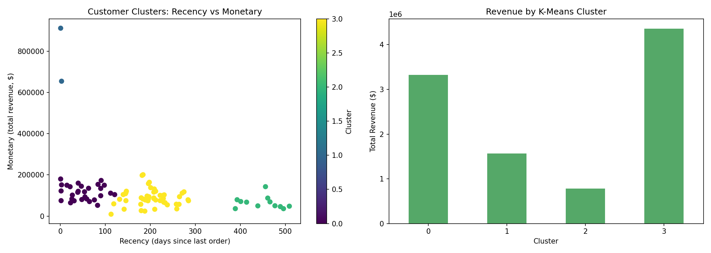

# Sales Performance Analysis — A Business Analytics Case Study

An end-to-end analysis of two years of transactional sales data (2003–2005) from a wholesale scale-model vehicle distributor, built to answer one question a manager actually asks: **where is revenue coming from, and where should we focus attention next?**

The project moves beyond simple descriptive charts into a customer-value segmentation model (RFM), and every finding is translated into a specific business recommendation.

📄 **[Read the full case study write-up](report/case_study.md)** — a business-audience narrative summarizing the findings and recommendations.
📓 **[View the analysis notebook](notebooks/sales_analysis.ipynb)** — the full code, statistics, and charts.

---

## Business questions answered

1. Which markets and product lines generate the most revenue?
2. Is there seasonality in demand, and what does it mean for planning?
3. Who are the most valuable customers, and who is at risk of churning?
4. Does deal size or order status meaningfully affect revenue?
5. Is pricing/discounting behavior consistent across product lines?

## Key findings

| Question | Finding |
|---|---|
| Top market | The USA generates ~37% of total revenue, more than Spain and France combined |
| Top product line | Classic Cars is the flagship product globally, leading in nearly every territory |
| Seasonality | Sales spike every October–November, consistent with holiday buying patterns |
| Customer value | A "Champions" segment of 21 customers (23% of the customer base) drives 44% of total revenue |
| Deal structure | Medium-sized deals — not large contracts — generate the most revenue |
| Fulfillment | 95%+ of revenue comes from successfully shipped orders |

## Customer segmentation (RFM)

Using Recency, Frequency, and Monetary value, customers were scored and grouped into actionable segments:


This identifies not just *who* the best customers are, but a specific **"At Risk"** segment — high-value customers who haven't ordered recently — as a concrete win-back target.

## Machine learning: K-Means clustering (an alternative view)

To validate the rule-based RFM segments against a data-driven approach, the same Recency/Frequency/Monetary features were also clustered using **K-Means**. Rather than confirming a generic pattern, K-Means isolated something the quartile method blurred: a **2-customer cluster generating ~$783K in revenue per customer** — roughly 7–12x the per-customer revenue of every other cluster — pointing to a small number of extreme-value accounts worth individualized account management.



## Sample visualizations

<table>
<tr>
<td></td>
<td></td>
</tr>
<tr>
<td align="center">Total sales by country</td>
<td align="center">Monthly sales trend (2003–2005)</td>
</tr>
</table>

More charts (product line performance, top customers, deal size, order status, pricing/discount analysis, and a territory × product heatmap) are in the [notebook](notebooks/sales_analysis.ipynb) and [`images/`](images) folder.

## Methodology

1. **Data cleaning** — handled encoding issues, checked for missing values and duplicates, converted date fields.
2. **Exploratory analysis** — sales distribution, breakdowns by country, product line, deal size, and order status.
3. **Time-series analysis** — monthly sales trend to identify seasonality.
4. **Pricing analysis** — average discount off MSRP by product line.
5. **Customer segmentation (RFM)** — quartile-based scoring on Recency, Frequency, and Monetary value, grouped into segments (Champions, Loyal Customers, Potential Loyalists, At Risk, Needs Attention) with a recommended action for each.
6. **K-Means clustering** — an unsupervised machine learning cross-check on the same RFM features (scaled with `StandardScaler`, k chosen via the elbow method), used to validate the manual segments and surface finer-grained structure among high-value accounts.

## Tools

- Python
- Pandas
- Matplotlib
- scikit-learn
- Jupyter Notebook

## Project structure

```
sales-analysis/
├── data/
│   └── sales_data_sample.csv
├── notebooks/
│   └── sales_analysis.ipynb
├── images/                  # exported chart images
├── report/
│   └── case_study.md        # business-audience write-up
├── requirements.txt
└── README.md
```

## Running this project locally

```bash
git clone https://github.com/MasoudKamali7/sales-analysis.git
cd sales-analysis
pip install -r requirements.txt
jupyter notebook notebooks/sales_analysis.ipynb
```

## Dataset

The dataset is a publicly available sample sales dataset for a wholesale scale-model vehicle distributor, containing 2,823 order lines across 19 countries between 2003 and 2005.

## Author

**Masoud Kamali**
[LinkedIn](https://www.linkedin.com/in/masoud-kamali-500958386/) · [GitHub](https://github.com/MasoudKamali7)
