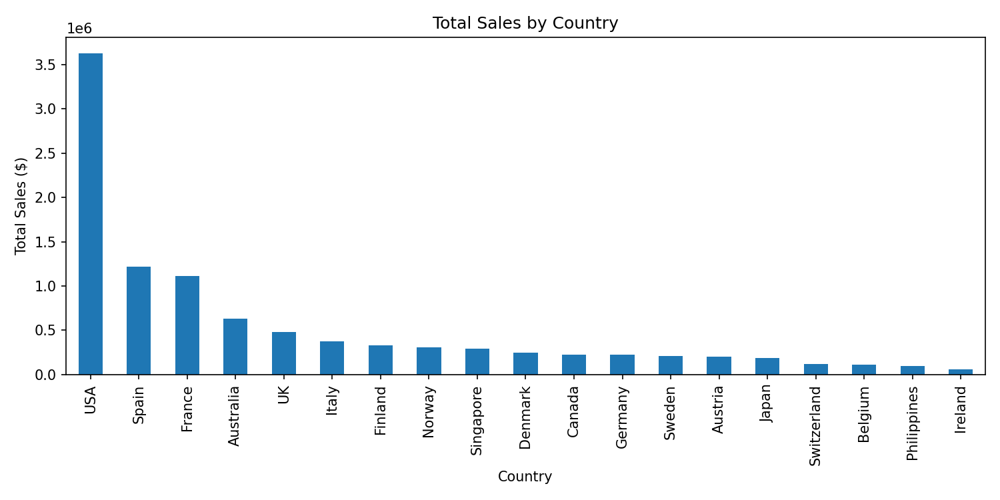
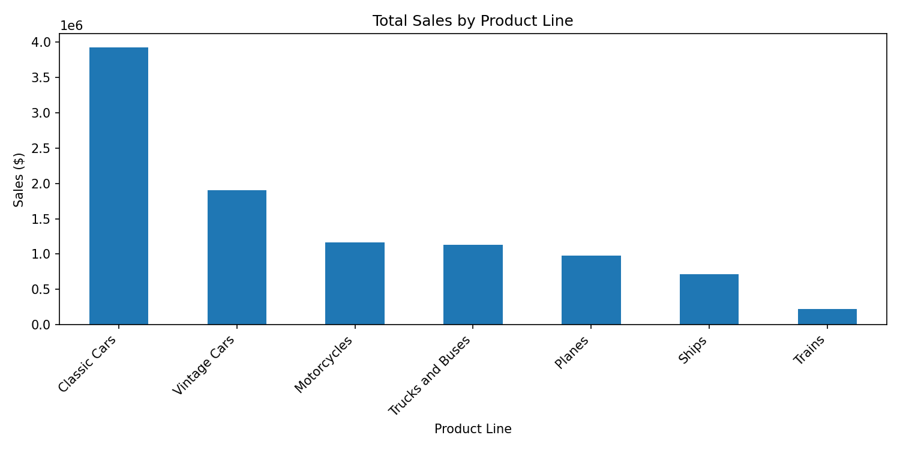
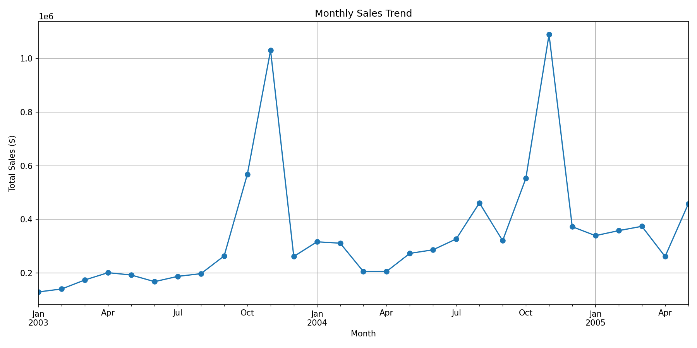
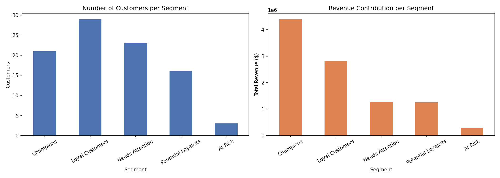
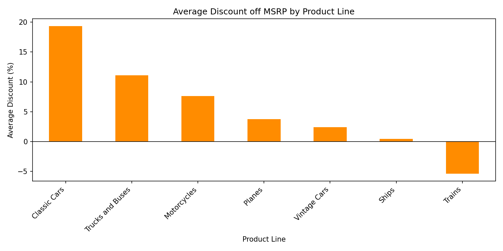

# Where Is the Revenue Coming From? A Sales Analytics Case Study

*A business-analytics case study based on two years (2003–2005) of transactional sales data from a wholesale distributor of scale-model vehicles.*

## The situation

The company sells collectible scale-model vehicles — cars, motorcycles, planes, ships, and trains — to distributors and retailers across 19 countries. Management has years of order data sitting in a spreadsheet, but no clear picture of where revenue is actually concentrated, whether demand is seasonal, or which customers matter most. This analysis turns 2,823 raw order lines into a set of decisions management can act on.

## 1. The U.S. is not just the biggest market — it's disproportionately important

Sales by country show the United States generating roughly **$3.6 million** in total revenue, well ahead of Spain (**$1.2 million**) and France (**$1.1 million**).

**Implication:** any disruption to the U.S. business — a key account leaving, a competitor entering, a shipping delay — has an outsized effect on total revenue. At the same time, Spain and France look like the most promising markets for incremental investment, since they are already proven second-tier markets rather than untested ones.

## 2. One product line carries the business

Classic Cars alone generated **$3.9 million** in sales — more than Vintage Cars and Motorcycles combined — and it wins in almost every sales territory (EMEA, APAC, and Japan alike). Trains, by contrast, generated only **$226K**, the smallest of the seven product lines.

**Implication:** Classic Cars is the product the business should protect and invest in first — new SKUs, better shelf placement, marketing spend. Trains is a candidate for a deliberate decision: invest in a turnaround, or scale back inventory and redirect the working capital elsewhere.

## 3. Revenue has a clear, predictable seasonal shape

Plotting monthly revenue over the full two-and-a-half-year window shows a consistent spike every October and November — the single highest month, November 2004, brought in over **$1 million**, roughly three times a typical month earlier in the year.

**Implication:** this isn't noise, it's a plannable pattern. Inventory builds, staffing, and cash-flow planning should be built around an October/November peak rather than treated as a surprise each year.

## 4. A small group of customers drives almost half of all revenue

To understand customer value more rigorously than a simple top-10 list, I built an **RFM segmentation** — a standard CRM/marketing-analytics technique that scores every customer on:

- **Recency** — how recently they last ordered
- **Frequency** — how many separate orders they've placed
- **Monetary** — how much total revenue they've generated

Each customer is scored 1–4 on each dimension and grouped into a segment.

The result: **21 customers (23% of the customer base) — the "Champions" segment — generate 44% of total revenue ($4.4M of $10M).** At the other end, a small "At Risk" segment (customers who used to spend heavily but haven't ordered recently) represents real, identifiable revenue at risk of being lost quietly.

| Segment | Customers | Revenue |
|---|---|---|
| Champions | 21 | $4.40M |
| Loyal Customers | 29 | $2.82M |
| Needs Attention | 23 | $1.27M |
| Potential Loyalists | 16 | $1.26M |
| At Risk | 3 | $0.28M |

**Implication:** this is the single most actionable output of the analysis. It converts "know your customers" from a slogan into a specific, prioritized to-do list:
- Protect the 21 Champions above everything else — a lost Champion account is the revenue equivalent of losing an entire small country market.
- Run a targeted win-back campaign on the 3 At-Risk accounts before they're gone entirely — the cost of retention here is almost certainly lower than the value at stake.
- Use lower-touch marketing (email, self-serve) for the "Needs Attention" segment rather than expensive account-management time.

## 4b. A machine-learning cross-check confirms the segments — and finds an even sharper distinction

The RFM segments above were built with rules I chose by hand (score thresholds). To check whether those thresholds reflect real structure in the data rather than an arbitrary cutoff, the same customer data was also clustered with **K-Means**, an unsupervised algorithm that groups customers by similarity without any predefined rules.

The result confirms the overall pattern, but also surfaces something the quartile method blurs together: a cluster of just **2 customers** generating roughly **$783K in revenue per customer** — 7 to 12 times the per-customer revenue of every other group. The quartile method's 21-customer "Champions" segment is directionally correct, but folds these two extreme accounts in with materially smaller (if still valuable) customers.

**Implication:** the 2 highest-value accounts likely warrant dedicated, named account management distinct from the broader Champions program — a level of resolution the rule-based segmentation alone doesn't surface.

## 5. No single lever dominates revenue — but deal count matters more than deal size

A correlation analysis between order quantity, unit price, revenue, and MSRP shows all three inputs have a moderate relationship with per-line revenue: **unit price** (0.66) and **product tier / MSRP** (0.64) correlate slightly more strongly with revenue than **quantity ordered** (0.55) does. In other words, *which* product and price tier is sold explains a bit more of the swing in line-item revenue than *how many units* are ordered — though the gap isn't large enough to call any one factor dominant.

The deal-size breakdown tells a clearer story: **medium-sized deals**, not large contracts, generate the most total revenue ($6.1M vs. $1.3M from large deals).

**Implication:** this isn't a business defined by a handful of whale deals — the bulk of revenue comes from a high volume of mid-sized transactions, which supports investing in the number and cadence of mid-sized deals over chasing a small number of large ones. Pricing strategy shouldn't be sidelined either: since price/tier correlates just as strongly with revenue as quantity does, testing discount depth (see Finding 6) is at least as promising a lever as volume-driving promotions.

## 6. Pricing discipline varies by product line

Average discount off MSRP ranges from **19% on Classic Cars** down to a **-5% "premium"** on Trains (i.e., Trains sold slightly above list price on average).

**Implication:** Classic Cars' deep average discount is easier to justify given its volume, but it's worth testing whether a smaller discount would meaningfully reduce demand — even a few points of margin recovered on the highest-volume line is a large absolute dollar impact.

## Recommendations, in priority order

1. **Launch a formal key-account program** for the 21 "Champions" identified by the RFM model — they are worth more than most single-country markets.
2. **Run a win-back campaign** targeting the "At Risk" segment before Q4, so it lands ahead of the seasonal peak.
3. **Plan inventory and staffing around the October–November demand spike** rather than reacting to it each year.
4. **Test a smaller discount on Classic Cars** in a limited market to measure the margin/volume trade-off.
5. **Make a deliberate call on Trains** — invest in a turnaround or reduce exposure — rather than letting it continue as an underperforming default.

## Methodology note

This analysis used Python (Pandas for data manipulation, Matplotlib for visualization, scikit-learn for clustering) on a dataset of 2,823 order lines. Data cleaning addressed a character-encoding issue in the source file and confirmed no duplicate records. The RFM model used quartile-based scoring, a standard and interpretable approach appropriate for a dataset of this size, and was cross-checked against a K-Means clustering model (features scaled, k selected via the elbow method) to confirm the segments reflect genuine structure in the data rather than arbitrary thresholds.

The full code, statistics, and all charts are available in the [analysis notebook](../notebooks/sales_analysis.ipynb).
